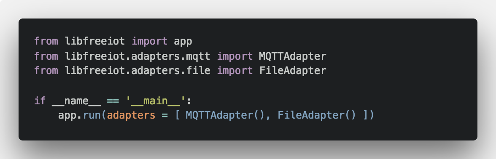

# FreeIOT

> 一个轻巧灵活的开源物联网中间件框架


[](https://pypi.org/project/libfreeiot/)
[](./LICENSE.txt)
[](http://makeapullrequest.com)

[English Introduction](./README_en.md)

## 特点

- :loop: 结构轻巧可靠，开发定制轻松
- :bulb: Adapter 设计，可扩展性强
- :unlock: 开源实现，安全可控（欢迎加入开发）
- :pencil: 文档齐全，简明易懂（WIP）

## 安装

### 通过包管理器安装

```shell
 pip install libfreeiot
```

### 构建安装

```shell
git clone https://github.com/noahziheng/freeiot.git
cd freeiot
python3 setup.py install --user # *nix 类系统使用
python setup.py install --user # Windows 系统使用
```

## 文档

[点击进入文档中心](https://noahziheng.github.io/freeiot)

## 与 FreeIOT v1 关系

FreeIOT v1 是全端支持的物联网开放平台，本人于 2016 年进行开发运营，基于 Node 生态构建服务端，并有设备侧支持方案及服务侧客户端。

特点是以模块为描述设备的基本原子，现已停止支持和营运。

库中 `backup/v1` 分支存放有 FreeIOT v1 的全部源代码及 Markdown 文档。

现 FreeIOT 项目参照了 v1 分支的部分思想，但已改采用 Python 实现，实为 Adapter 形式的中间件框架，与 v1 分支并无实质关联。

## 相关项目

- [Flask](https://github.com/pallets/flask)
- [PyMongo](https://github.com/mongodb/mongo-python-driver)
- [Eclipse Paho](https://www.eclipse.org/paho/)

## 捐助

支付宝：noahgaocn@outlook.com (\*梓恒)

> 如果我的工作对您有所帮助，欢迎您对本项目进行捐助。

## 开源授权

  Copyright (C) 2017 Noah Gao <noahgaocn@gmail.com>

  Licensed under the GNU General Public License (GPL) v3.
  For more information see LICENSE.txt.
