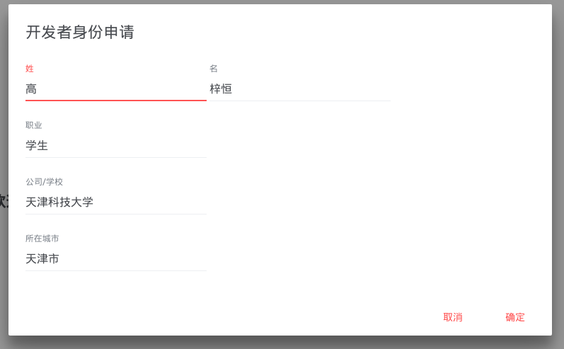
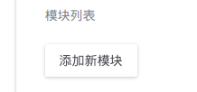
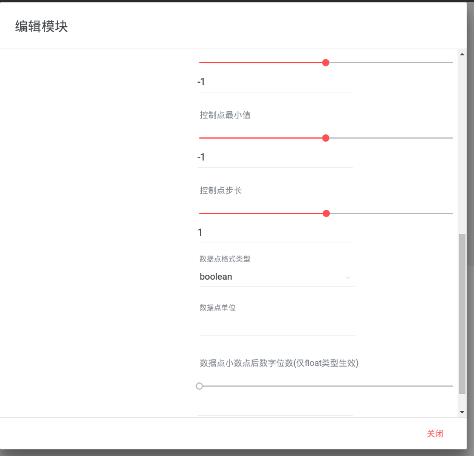
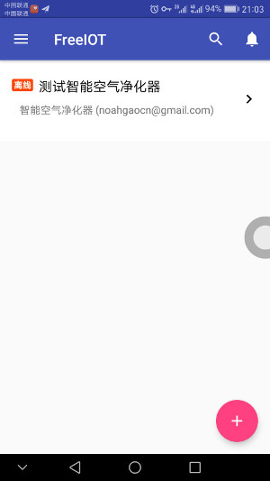
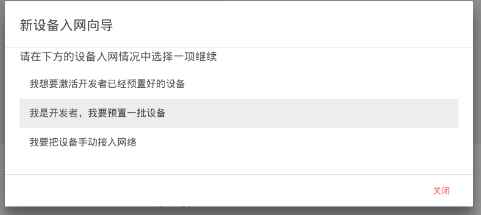
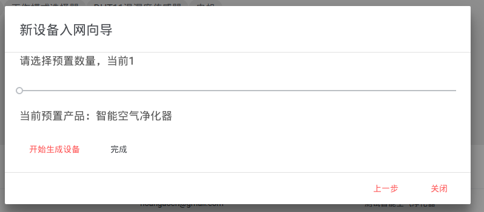

# 开发者快速指南
FreeIOT是自由的物联网平台，您可以在平台上开发自己的产品，然后将产品添加为设备进行使用。FreeIOT的开发基于[模块](/design/mod.md)驱动，简单易学。本教程将通过开发一个智能空气净化器的产品原型并添加其测试终端入网的实例来讲解FreeIOT的主要开发方法。
> 注：以下所有提到的操作均需在登录后操作。

> 本教程基于 https://github.com/noahziheng/SimpleSmartAirPurfier 项目写成

## 开发者身份申请
考虑到资源分配的因素，FreeIOT系统内都预置有开发者身份的申请系统，在您计划开发新的产品原型之前需要先进行申请。

注册用户后在Web端控制台右侧可以看到申请开发的有关提示，点击申请按钮；

在接下来弹出的对话框里填入相应信息，然后提交，等待审核

> 组织申请： 开发者信息会被显示给用户，如果您需要显示组织名而非个人开发者，可将“姓"、"单位"栏留空，将组织名填入“名”即可。(在FreeIOT官方站，学校等非营利组织暂不能进行这种申请)

审核通过后开发者提示将消失，权限标志也将改为”开发者“。

## 新建产品原型

在Web端控制台右侧可以找到添加新产品按钮

按输入框提示键入产品的基本信息

> 产品描述使用Markdown语言，使用指南见[这里](http://wowubuntu.com/markdown/)

### 分析模块构成
根据项目README声明的情况，本项目在FreeIOT上可分为以下模块
- DHT11温湿度传感器： 两个上传量（温度/湿度），有专用模块
- GP2Y1010AU0F： 两个上传量（AQI/PM2.5浓度），有专用模块
- L298N电机驱动： 一个控制量（速度），基于标准模块自声明
- 电机： 一个控制量（开关），基于标准模块自声明
- 工作模式选择器： 一个控制量（开关），基于标准模块自声明
- 上下限阈值控制器： 两个控制量（AQI上限/AQI下限），有专用模块

### 添加新模块
以DHT11温湿度传感器和L298N电机驱动为例进行演示，点击添加新模块

点选DHT11温湿度传感器，使用默认配置确定（[详细使用说明](../design/mods/dht11.md)）

再点击添加新模块按钮

点选标准单点控制器，按图示配置（[详细使用说明](../design/mods/std-down.md)）

### 完成新建
全部添加完毕后，在控制台我的产品原型可找到新的产品，点击查看可查看详情

## 新建设备
产品原型新建后还需要建立设备
### 手动添加（内部测试）
> 手动添加设备目前仅支持Android客户端

> 此功能可能还存在BUG，如遇[FAQ](../faq.md)无法找到的问题请及时反馈。

请在Android客户端首页右下角找到添加新设备按钮,如：

点击后弹出添加新设备向导，请选择手动引导

随后会弹出新设备入网向导，请按提示操作

### 批量添加（生产/供非专业用户使用）
> 批量添加设备目前仅支持Web客户端

> 批量添加的设备激活时暂时不能使Firmware连接新的Wifi，您需要自行参照Firmware文档开发连接Wifi功能，我们将在下一个迭代版本完善该部分
请在控制台页面右侧找到添加新设备按钮,如：

在Web客户端产品详情页面右下角找到添加按钮

点击后弹出添加新设备向导，请选择我要预置一批设备

用滑块输入需要生成的设备数量，点击生成

得到结果后，请自行保存并按有关文档开发，然后直接关闭即可

## 大功告成
完成设备添加后，进入新设备页面即可开始新的物联生活啦～

至此，教程已基本结束，如果您还想对本系统有更多了解，欢迎到[系统设计理念](../design/README.md)查看详细开发者文档。

如您在操作中遭遇问题，请到[FAQ](../faq.md)页面寻求帮助。
