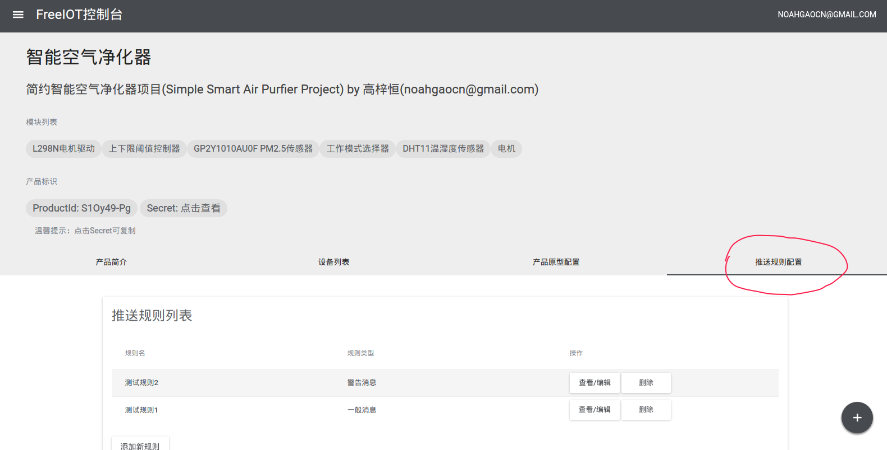

# 消息推送规则
FreeIOT支持在特定情况下向客户端推送消息，这一系统可通过配置产品原型的推送规则来使用。

本文假设您对本章介绍的FreeIOT的其他要素已有了基本了解，并阅读过[开发者快速指南](../howtouse/developer.md)，了解如何建立产品模型的流程。如果您还没有阅读过，还请您先行了解后再来阅读本文。

## 添加与管理推送规则
您可以在产品原型页找到“推送规则配置”选项卡，我们的各项操作将在此处进行。


## 规则名称
该名称将显示在配置页面，向您和用户展示，必填，作为人类识别推送规则的唯一标志

## 触发标志点
每条规则都需设置此项，服务器将在指定的标志点数据发生变化时检查规则，如符合规则设定则会发送推送消息。

注：该项可填写多个标志点，通过英文逗号,断开即可

## 消息类型
消息类型主要有用于使用户可选择性关闭不够重要的消息推送，并能控制消息发送的间隔，避免过于打扰用户

|    类型名    | 描述 | 间隔时间 |
| ---------- | --- | ------ |
|  系统消息 | 系统使用的消息类型符，如无特别必要不建议使用 | 无限制 |
|  一般消息 | 通常的消息，不重要的通知使用，默认 | 5分钟 |
|  特别消息 | 较为重要的消息，需要及时提醒的通知 | 2分钟 |
|  警告消息 | 特别重要的消息，慎用 | 1分钟 |

其中，间隔时间为服务器匹配是否发送时检查，方法是检查上一条同设备发往同用户的同类型消息的发送时间是否在间隔内，如不在则发送。

间隔时间和推送设置仅对“推送”操作有效，不影响用户主动查阅

## 触发条件表达式
请在此项中填写符合JavaScript（ES6规范） if语句规范的条件表达式，可使用下面的变量：

|    变量名    | 描述 |
| ---------- | --- |
|  **newData** | 变化后的数据对象，其中标号为数据标志 |
|  **oldData** | 变化前的数据对象，其中标号为数据标志 |

下面给出几个实例：

温度（标志为T）超过30时

```
newData.T >= 30
```

湿度（标志为H）发生变化,且已低于12.5时

```
newData.H !== oldData.H && newData.H <= 12.5
```

智能模式已启动（标志为MODE）或电机开关（标志为M）被关闭时
```
newData.MODE === true || newData.M === true
```

## 消息模板
该项中的内容将会经过[mustache模板引擎](https://mustache.github.io/)渲染后发送，其使用的数据集与上述表达式中可用的完全一致

例如：

原始值：```温度已超标，当前温度{{newData.T}}°C```

渲染后发送：```温度已超标，当前温度35°C```

原始值：```电机被{{#newData.M}}启动{{/newData.M}}{{^newData.M}}关闭{{/newData.M}}```

渲染后发送：```电机被启动```

## 默认发送的消息
FreeIOT将会在设备上下线时发送系统级消息推送。

## 当前支持的客户端
> 最后更新：2017.4.10

|    客户端    | 当前状态 |
| ---------- | --- |
|  **Android** | 已完整实现，通知列表因使用WebView速度较慢且消耗流量，待优化 |
|  **Web** | 查看、设置部分已完整实现，实时通知暂未完成 |
