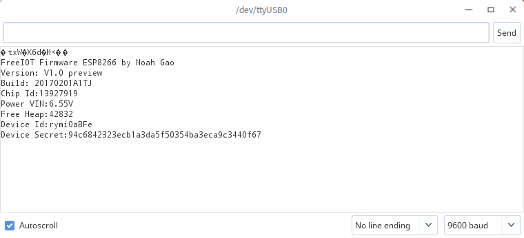

# FreeIOT Firmware For ESP8266 说明文档
FreeIOT Firmware For ESP8266是基于ESP8266 for Arduino开发的FreeIOT Firmware实现。

## 下载
本固件包括一个bin文件，暂不包括刷写工具包。

固件最新下载地址：https://ota.iot.noahgao.net:5000/firmware/esp8266/v1.0-preview-20170201A1TJ.bin

历史版本请查阅：https://github.com/noahziheng/freeiot/tree/master/ota/firmware/esp8266

## 刷写
请参考 http://bibis.ai-thinker.com/esp8266 提供的说明文档，连接您的ESP8266模块进入刷写模式(GPIO0下拉)。【编者按：安信可提供的文档越来越辣鸡。。不同模块的刷写连线图Google一抓一大把，可能会比翻文档更快】

然后请到 https://github.com/igrr/esptool-ck/releases 下载最新的适配您的系统的esptool工具，解压，将下载的bin文件重命名为t.bin放置到与esptool（或esptool.exe）同目录下。

准备好后用USB-TTL串口模块连接到计算机，自行获取串口号，Windows下为COMX，Linux下为/dev/ttyUSBX（X为数字），此处以Linux为例，串口号为/dev/ttyUSB0。

在esptool目录下执行(Linux/Mac)：

```
  sudo ./esptool -cp /dev/ttyUSB0 -cb 9600 -cd none -ca 0x00000 -cf t.bin
```

Windows需要按住shift右键esptool.exe所在目录，选择在此处打开命令窗口，然后执行命令:

```
  esptool.exe -cp /dev/ttyUSB0 -cb 9600 -cd none -ca 0x00000 -cf t.bin
```

其中,9600是波特率，如您的模块不同，请设为实际的波特率。

none还可能为ck或nodemcu，如果您不清楚它的含义也没有遇到问题，请使用none。

## 测试
刷写后请将模块断开连接，将GPIO0上拉，重新连接，使用串口工具以9600波特率查看到如下结果，说明已正常刷入。



如果没有看到，请尝试断开模块的电源，重新上电，如一直不能看到或看到其他打印信息，请尝试重新刷写。

## 使用
前文提到，ESP8266固件以9600波特率运行串口。其他使用方法完全符合[FreeIOT Firmware规范](firmware.md)。

如您遇到问题，可在https://github.com/noahziheng/freeiot-firmware-esp8266 仓库提出issue，或发送邮件到noahgaocn@gmail.com寻求帮助。
