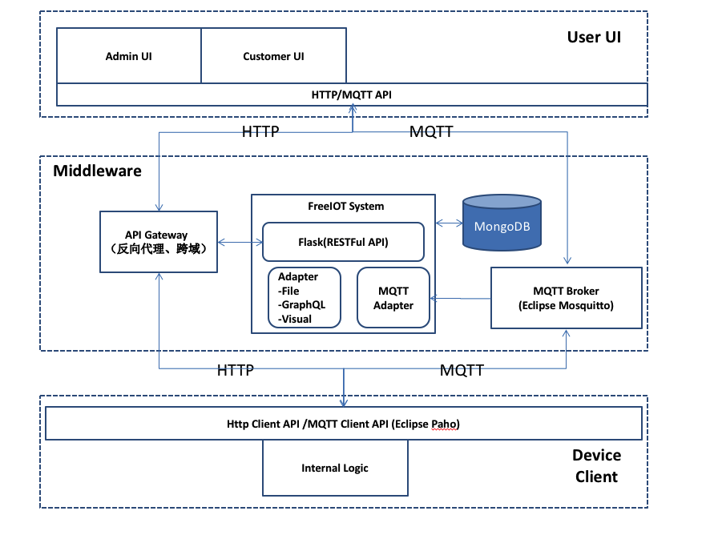
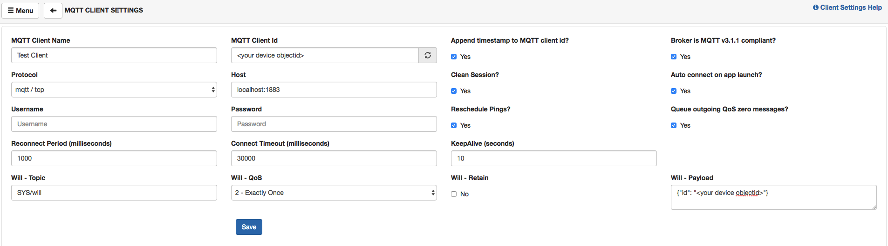
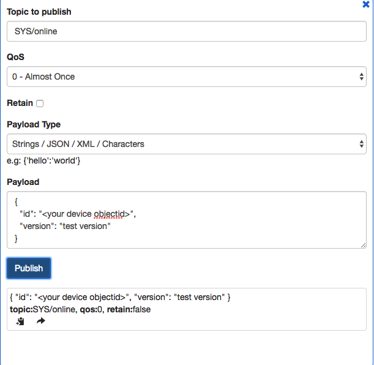
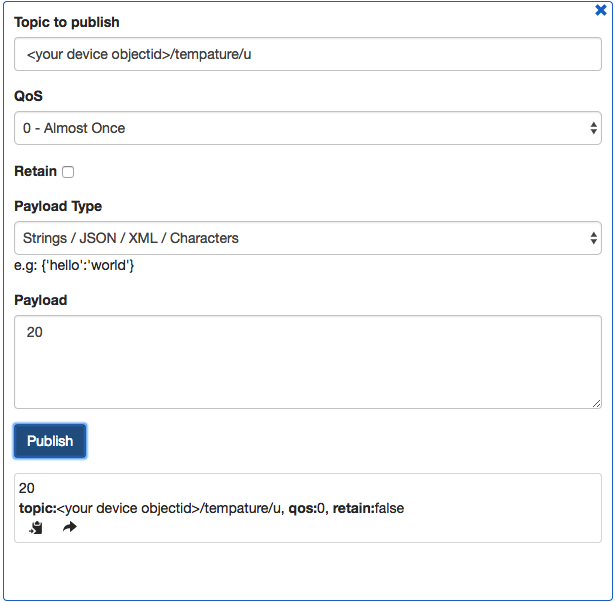

# 实例1：MQTT 方案保存温度数据

在本文中，我们将带领读者，完成一个小的温度传感器上传温度到 FreeIOT 系统的一个模型。

## 准备工作

首先，建议读者全文阅读 [FreeIOT 快速指南](./README.md)，并对使用 Python3 编程具有一定的基础。

其次，我们将用到下列工具：

- curl 命令行工具，用于操作命令行（习惯图形界面的读者可用 Postman 等 GUI 工具代替）
- MQTTBox Chrome 扩展，用于模拟设备侧行为（熟悉 MQTT 编程的读者亦可自行编写 MQTT 客户端代替）
- 最新版本的 libfreeiot 开发库
- 已安装的 MongoDB 数据库

如果您最好对 [MQTT](https://mqtt.org) 有所了解，中文协议推荐阅读 [https://github.com/mcxiaoke/mqtt](https://github.com/mcxiaoke/mqtt)。

## MQTT Broker

使用 FreeIOT 开发 MQTT 方案的物联网系统，需要借助特有的 Adapter 机制，官方提供支持的 MQTTAdapter 功能为消息监听器，需要单独配置 MQTT Broker，形如下图：



MQTTAdapter 建议使用 [Eclipse Mosquitto](https://mosquitto.org/)，这是兼容性最好的选择，当然，使用其他符合 MQTT3 协议的 Broker 都可被兼容。

我在这里已经配置好了一个 Mosquiito，使用 TCP 协议在 1883 端口提供服务。

## 搭建系统

我们首先建立 `.env` 配置文件如下：

```dotenv
# 全局配置
APP_PORT = 3000
APP_DEBUG = false
FLASK_CONFIG = development
MONGO_HOST = localhost
MONGO_PORT = 27017
MONGO_DBNAME = freeiot

# MQTT Adapter 配置
MQTT_HOST = localhost
MQTT_PORT = 1883
MQTT_CLIENTID = "mqtt-guide"
MQTT_PARSE_DRIVER = json
TOPICS_NEED = ["tempature"]
```

再建立一个 `manage.py` 启动脚本：

```python
from libfreeiot import app
from libfreeiot.adapters.mqtt import MQTTAdapter

app.run(adapters = [ MQTTAdapter() ])
```

以上我们配置了一个具有 MQTT 功能的 FreeIOT 系统，MQTT Adapter 将在系统启动后介入观察本地 MQTT Broker 中的设备行为，并关注 `tempature` 主题。

> MQTTAdapter 使用的 Paho 库目前与调试模式存在冲突，使用 MQTT 时请关闭调试模式 `DEBUG`，修改代码后手动重启程序。

接下来使用 `python3 manage.py` 即可跑起这个系统。

## 建立设备

我们首先获取 JWT 凭证，FreeIOT 的默认用户名密码为 `admin/admin`，运行以下命令：

```shell
 curl http://127.0.0.1:3000/api/auth\
    -H "Accept: application/json"\
    -H "Content-type: application/json"\
    -X POST\
    -d '{"username":"admin", "password": "admin"}'
```

可以得到

```json
{
    "jwt": "<your jwt token>"
}
```

再运行：

```shell
 curl http://127.0.0.1:3000/api/device\
    -H "Accept: application/json"\
    -H "Content-type: application/json"\
    -H "Authorization:Bearer <your jwt token>"\
    -X POST\
    -d '{"remark": "测试样机", "status": 0, "version": "Unknown"}'
```

可以得到

```json
{
    "remark": "\u6d4b\u8bd5\u6837\u673a",
    "_id": {
        "$oid": "<your device objectid>"
    }
}
```

已经熟悉 FreeIOT 的读者可以了解到，我们通过 RESTFul API 接口建立了一个名为“测试样机”的设备，当前不在线，版本未知。

## MQTT 登场

好了，我们的配置部分到此就已经结束了，接下来就是模拟设备的行为，我们首先打开 `MQTTBox` 建立一个 MQTT Client，并修改其连接信息如下：



我们主要是修改了 ClientId 来保证设备唯一，修改了 MQTT Broker 的连接地址，并配置了一份“遗嘱（will）”来让 FreeIOT 知悉设备的离线。

接下来，新建一个 Publisher，用于向 FreeIOT 宣示设备上线。



如果一切正常，在 FreeIOT 的运行窗口中将可以看到：


然后，我们来上传数据，新建一个 Publisher，向 `<your device objectid>/tempature/u` 这一 topic 推送一个“假”温度（注意此处的温度数据本质上是 JSON，只不过 JSON 规定不加修饰符的就是数字）



最后，我们来检验一下成果，运行：

```shell
 curl http://127.0.0.1:3000/api/device/<your device objectid>\
    -H "Accept: application/json"\
    -H "Content-type: application/json"\
    -H "Authorization:Bearer <your jwt token>"\
```

可以看到

```json
{
    "_id": {
        "$oid": "5a9a8e31baf04c21194069d3"
    },
    "remark": "\u6d4b\u8bd5\u6837\u673a",
    "status": 1,
    "version": "test version",
    "lastdata": {
        "tempature": {
            "flag": "u",
            "content": 20,
            "original": {
                "$ref": "datas",
                "$id": {
                    "$oid": "5a9b71a4baf04c3898fc9a2c"
                }
            }
        }
    }
}
```

可以清晰地看到，“假”温度已经正常存入了系统，至此，实例完成~

本文只是大概的介绍了 MQTTAdapter 的简单用法和协议格式，深入了解仍需参见 [MQTTAdapter 说明文档](../adapter/mqtt.md)。
