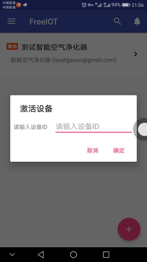

# 用户快速指南
FreeIOT是自由的物联网平台，您可以在平台上添加在本平台上开发的产品为设备，添加的新设备将显示在您账号的设备列表中。可以随时随地查询设备上报的数据、控制设备。以下介绍两种添加设备的方式，请按照开发者提供的方法添加。
> 注：以下所有提到的操作均需在登录后操作。

## 激活开发者预置的设备
如果开发者已将设备预置在平台上，请按照以下步骤进行操作。
### Web客户端上的操作
请在控制台页面右侧找到添加新设备按钮,如：

点击后按以下提示操作进入产品界面

在页面右下角找到添加按钮

点击后弹出添加新设备向导，请选择激活已预置设备

最后输入开发者提供的产品ID，点击查询

得到查询结果后点击添加完成

### Android客户端上的操作
请在首页右下角找到添加新设备按钮,如：

点击后弹出添加新设备向导，请选择激活已预置设备

最后输入开发者提供的产品ID，点击确定完成整个流程

## 手动添加设备
如果开发者并未预置设备，或者您需要重新激活设备或者连入新的Wifi网络，请使用手动添加方法。
> 手动添加设备目前仅支持Android客户端

> 此功能可能还存在BUG，如遇[FAQ](../faq.md)无法找到的问题请及时反馈。

请在首页右下角找到添加新设备按钮,如：

点击后弹出添加新设备向导，请选择手动引导

随后会弹出新设备入网向导，请按提示操作

## 大功告成
完成设备添加后，进入新设备页面即可开始新的物联生活啦～

如果您还想对本系统有更多了解，欢迎回到[首页](../README.md)查看更多文档。

如您在操作中遭遇问题，请到[FAQ](../faq.md)页面寻求帮助。
